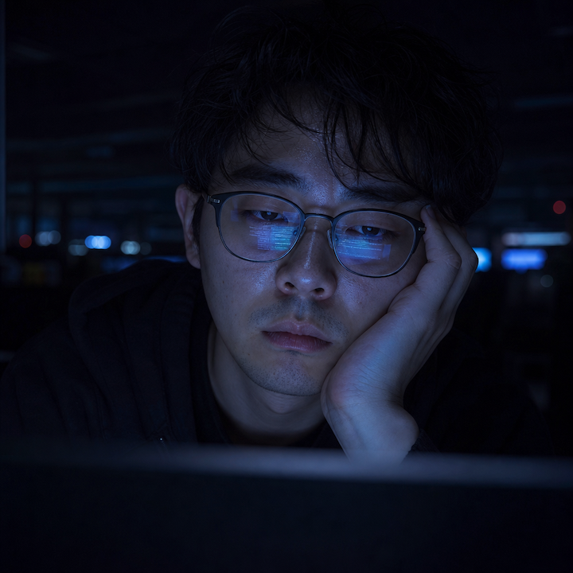
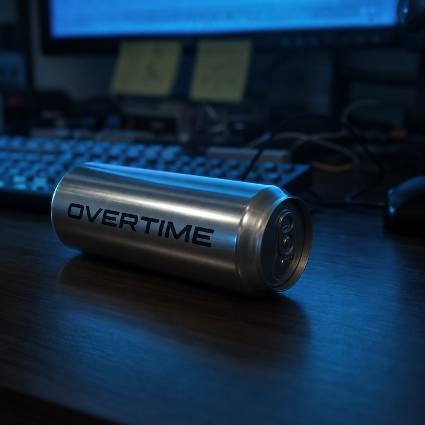
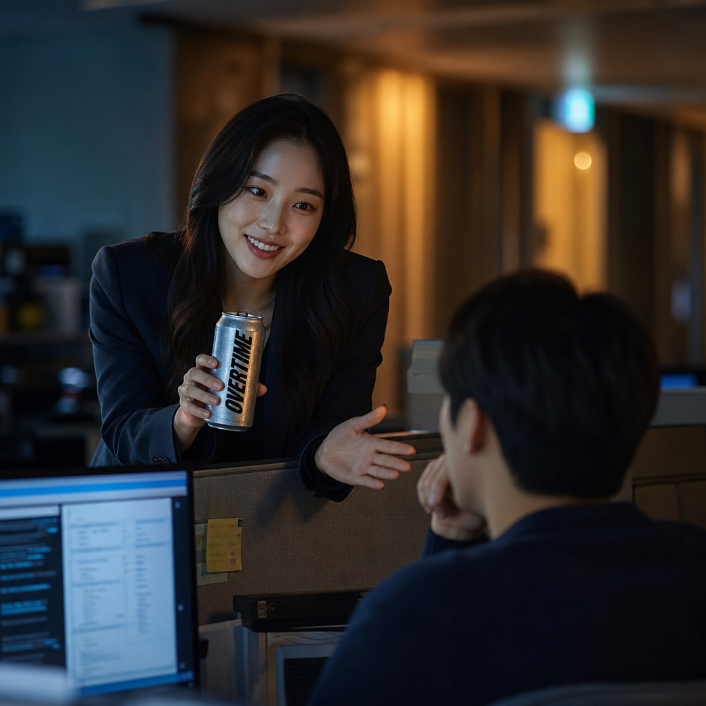

# 🎬 [2단계] 오버타임 광고 캠페인 스토리보드

**OVERTIME 광고 캠페인 스토리보드: "대한민국에서 살아남는 K-직장인의 우정"**

## 1. 프로젝트 개요

- **컨셉:** 박카스 광고 패러디 ("대한민국에서 성실한 사람으로 산다는 것")
- **총 영상 길이:** 34초
- **대상:** 더 나은 미래를 위해 묵묵히 노력하는 모든 직장인, 학생, 성실한 사람들
- **사용 도구 체인:**
  - **이미지 생성:** GPT-5, Gemini Pro 3.1
  - **동영상 생성:** Gemini Pro 3.1 (Cut 2-1~끝), Sora 2 (Cut 1-1, 1-2)
  - **오디오/TTS:** Gemini 3.1 flash TTS, Gemini Pro 3.1 (배경음악)
  - **편집:** Canva, google flow

## 2. 파이프라인 전략

- **최적화:** Sora 2(최대 4초) 및 Gemini Pro 3.1(10초 생성 후 컷 편집)를 활용하여 리듬감 확보.
- **몽타주 기법:** 롱테이크 시 발생하는 물리 법칙 왜곡을 방지하기 위해 7개의 정교한 4~10초 단위 컷으로 분할 생성.
- **소스 일관성:** 씬 이미지를 프롬프트로 변환하거나, 필요 시 외부 링크를 활용하여 일관성 유지.

## 3. 스토리보드 구성

### [Cut 1-1] 인물 초근접 클로즈업

- **길이:** 4초  
- **목표 메시지:** 야근에 지친 K-직장인의 피로감 전달
- **화면 구성:** [구도] 익스트림 클로즈업 샷 / [피사체] 멍하니 노트북을 응시하는 개발자의 눈과 안경 / [배경] 불 꺼진 어두운 사무실 / [텍스트] 없음
- **내레이션:** "대한민국에서 성실한 사람으로 산다는 것."
- **사용 도구:** 이미지(GPT-5, 사실적 안경 반사광 구현), 영상(Sora 2, 미세한 눈 깜빡임)
- **입력 프롬프트 (이미지):** A highly detailed, cinematic extreme close-up shot of a tired South Korean male software engineer in his late 20s, staring blankly at a laptop screen in a completely dark office at night. The cold blue light of the coding screen is intensely reflected on the lenses of his glasses, obscuring his eyes slightly and emphasizing his burnout. His head is supported by his hand, weary expression, dark circles under his eyes, realistic skin texture with sweat. The background is a vast, dark open-plan office with only distant, blurred LED indicators. Lighting is dark and moody with a dramatic contrast between the cold blue light and shadows. Shot on Sony A1, 16:9 aspect ratio, 8k resolution, ultra-photorealistic, shallow depth of field.
- **입력 프롬프트 (비디오):** [Use Image: [http://mong.or.kr/contents/cut01_01.png](http://mong.or.kr/contents/cut01_01.png) as Frame 0] CRITICAL DIRECTION: This video MUST be generated using the provided image URL as the strict, unalterable first frame. Do not change the identity of the person, clothing, or the environment. ANIMATION INSTRUCTION: Strictly lock the composition of the input image. Animate ONLY the fingers making them move in a natural, rhythmic typing motion on the mechanical keyboard. The rest of the scene must remain 100% consistent with the original image. Execute smooth motion blur for the hands while maintaining the exact cinematic low-light atmosphere.
- **결과 요약:** 안경에 코딩 화면이 반사된 지친 눈빛 확보
- **파일명:** `cut_01_01.png`, `cut_01_01.mp4`

### [Cut 1-2] 데스크 인서트 샷

- **길이:** 4초 
- **목표 메시지:** 밤샘 코딩 노동의 시각화
- **화면 구성:** [구도] 매크로 로우앵글 샷 / [피사체] 기계식 키보드를 두드리는 손가락 / [배경] 코드 IDE 화면 하단 / [텍스트] 없음
- **내레이션:** (기계식 키보드 타이핑 효과음)
- **사용 도구:** 이미지(GPT-5, 디테일한 손 피부 묘사), 영상(Sora 2, 물리 법칙에 따른 키보드 모션)
- **입력 프롬프트 (이미지):** [Style Reference: [http://mong.or.kr/contents/cut01_01.png](http://mong.or.kr/contents/cut01_01.png)] Cinematic medium close-up shot focusing on the hands of the South Korean male developer from the reference image, actively typing on a sleek mechanical keyboard. The hands should have slightly dry and textured skin to emphasize fatigue and hard work, avoiding an overly clean look. The environment is dimly lit, with the bright blue coding interface from the laptop screen illuminating the hands and the desk surface. Scattered notes, a half-empty coffee mug. Professional cinematography, 8k, photorealistic, shallow depth of field.
- **입력 프롬프트 (비디오):** [Use Image: [http://mong.or.kr/contents/cut01_02.png](http://mong.or.kr/contents/cut01_02.png) as Frame 0] Maintain the exact consistent appearance of the hands and environment from the source image. The fingers should move naturally and rhythmically on the mechanical keyboard, performing a focused typing action. Add a subtle, realistic flickering light effect from the monitor onto the hands and the desk surface to enhance the dark office atmosphere. Smooth, steady motion matching the focused mood.
- **결과 요약:** 건조한 피부 질감이 살아있는 손가락의 자연스러운 타이핑 모션 생성
- **파일명:** `cut_01_02.png`, `cut_01_02.mp4`

### [Cut 2-1] 캔 음료 미끄러짐

- **길이:** 4초 
- **목표 메시지:** 예상치 못한 호의의 진입
- **화면 구성:** [구도] 책상 수평 트래킹 샷 / [피사체] 어두운 책상을 미끄러져 오는 캔 / [배경] 헝클어진 마우스 선 / [텍스트] 없음
- **내레이션:** "당신의 야근 회복제는..."
- **사용 도구:** 이미지(GPT-5, 캔의 하이퍼 리얼리스틱 질감), 영상(Gemini Pro 3.1, 슬라이딩 물리 엔진)
- **입력 프롬프트 (이미지):** A close-up cinematic shot continuing the scene from [http://mong.or.kr/contents/cut_01_02.png](http://mong.or.kr/contents/cut_01_02.png). A cinematic, low-angle tracking shot at desk level in a dark, moody South Korean office. An upright, sleek silver metallic beverage can smoothly slides across the surface of a dark wooden desk. The bold, modern text "OVERTIME" is clearly printed on the side. The metallic surface dynamically reflects the blue screen light as it moves, with hyper-realistic condensation drops on the can. Shallow depth of field, blurred mechanical keyboard background. Ultra-photorealistic, 8k.
- **입력 프롬프트 (비디오):** [IMAGE ANCHOR] A highly detailed, photorealistic wide shot of a cylindrical brushed silver aluminum beverage can. [ACTION] A human hand briefly enters the frame from the top left and gives the can a swift push. The can then slides rapidly from left to right across the dark wooden desk. As it slides, the can rotates smoothly on its longitudinal axis, causing the "OVERTIME" text to spin. The sliding motion is fast at first, then gradually decelerates to a smooth stop. Ultra-realistic physics of sliding, friction, and rolling. High resolution, 8k, moody cinematic lighting.
- **결과 요약:** 물리 법칙이 적용된 정교한 캔의 슬라이딩 및 회전 액션 확보
- **파일명:** `cut_02_01.png`, `cut_02_01.mp4`

### [Cut 2-2] 캔 정지 및 브랜드 노출

- **길이:** 4초 
- **목표 메시지:** 제품명 'OVERTIME'의 시각적 각인
- **화면 구성:** [구도] 익스트림 매크로 샷 / [피사체] 멈춰 선 캔의 라벨 / [배경] 흐릿한 코딩 화면 / [텍스트] 'OVERTIME' 선명한 라벨링
- **내레이션:** "...무엇입니까?"
- **사용 도구:** 이미지(GPT-5), 영상(Gemini Pro 3.1, Focus-in 모션)
- **입력 프롬프트 (이미지):** Extreme macro shot. The cylindrical brushed silver aluminum can slides and comes to an abrupt, hard stop next to a laptop. Immediately upon stopping, the camera dynamically pulls focus onto the crisp, black 'OVERTIME' typography. The can is heavily encrusted with hyper-realistic ice crystals and condensation.
- **입력 프롬프트 (비디오):** A cinematic 8k single-take shot of a slender brushed silver aluminum can sliding extremely fast from the left across a dark desk and coming to a sudden, hard stop. The can is covered in hyper-realistic frost and water condensation, with the bold black text 'OVERTIME'. Immediately upon stopping, the camera executes a single, perfectly smooth, continuous zoom-in directly onto the 'OVERTIME' logo. The entire word must remain 100% visible, never getting cut off. Perfect steady camera, no bouncing.
- **결과 요약:** 포커스 인을 통한 제품명 각인 비주얼 완성
- **파일명:** `cut_02_02.png`, `cut_02_02.mp4`

### [Cut 3-1] 캔을 움켜쥐는 손

- **길이:** 4초 
- **목표 메시지:** 호의를 받아들이는 주체적 액션
- **화면 구성:** [구도] 주인공 POV 샷 / [피사체] 캔을 꽉 쥐는 손 / [배경] 키보드 / [텍스트] 없음
- **내레이션:** "대한민국에서 성실한 사람으로 산다는 것,"
- **사용 도구:** 이미지(GPT-5, 서리 질감), 영상(Gemini Pro 3.1)
- **프롬프트 수정 로그:**
  - **[수정 전]** "손이 캔을 잡는 모습" 지시. 손과 캔의 부자연스러운 렌더링, 캔 비율 붕괴 현상 발생.
  - **[수정 후]** `Standard-sized 355ml sleek can`, `OVERTIME text engraved vertically` 등 캔의 규격과 텍스트 제약 조건 추가.
- 입력 프롬프트 (이미지): A cinematic, low-light, extreme macro photograph. A standard-sized 355ml sleek brushed aluminum can stands perfectly upright on a dark surface. The can is completely encrusted with thick frost, heavy water condensation droplets, and small ice crystals, making it look freezing cold. A male's right hand with a black sleeve grips the can tightly. The bold, black, brushstroke-style text 'OVERTIME' is engraved vertically across the can't body. The blurred bokeh background shows a moody office at night with glowing, blurred computer screens displaying lines of code. Dramatic, high-contrast lighting with a strong cool blue ambient hue. 8k, photorealistic.  
- **입력 프롬프트 (비디오):** A first-person perspective (POV) shot. A photorealistic, tall, slender brushed silver aluminum can stands perfectly upright on a dark wooden desk. The can is covered in hyper-realistic frost and condensation. The bold black text 'OVERTIME' is printed vertically on the can. A male right hand, wearing a dark black sleeve, enters the frame from the right side. The hand moves smoothly and realistically, reaching out and firmly gripping the cold can. The fingers wrap naturally around the metallic surface. The can and typography remain perfectly sharp and static.
- **결과 요약:** 비율이 교정된 캔과 손의 안정적인 움켜짐 씬 확보
- **파일명:** `cut_03_01.png`, `cut_03_01.mp4`

### [Cut 3-2] 동료의 따뜻한 미소

- **길이:** 6초 
- **목표 메시지:** 지친 밤의 연대감 전달
- **화면 구성:** [구도] 미디엄 샷 / [피사체] 파티션 너머의 동료 / [배경] 앰버 조명 사무실 / [텍스트] 없음
- **내레이션:** "동기야, 우리 이번에 퇴근하자."
- **사용 도구:** 이미지(GPT-5), 영상(Gemini Pro 3.1, 따뜻한 웜톤 라이팅)
- 입력 프롬프트 (이미지):[STYLE REFERENCE - DO NOT GENERATE, USE AS STYLE GUIDE]  Cinematic late-night office scene. East Asian male subject, warm beige skin tone, realistic photographic texture, cold blue monitor lighting mixed with warm amber accent.  SHIRT: Deep navy blue knit sweater / long-sleeve top, color: #1a2340 ~ #1e2a4a, soft fabric texture, reflecting cold blue monitor light on surface. 4K, shallow DOF.  CAN DESCRIPTION (MUST MATCH EXACTLY): - Standard aluminum energy drink can (not slim — regular proportion) - Surface: brushed silver-grey aluminum with realistic    condensation water droplets all over - Label text: "OVERTIME" - Font: Bold italic condensed sans-serif,    heavy weight, slightly right-leaning italic angle   (similar to Impact Italic or Bebas Neue Italic style) - Letter color: pure black (#000000), flat, no gradient - Text placement: centered horizontally on can body,    large and dominant - Lighting on can: left side cold blue (#4a90d9),    right side warm amber (#c87941),    creating metallic gradient across surface   [GENERATE THIS SCENE]  Medium shot. South Korean female colleague, late 20s, business casual dark blazer, leaning over office partition at night. Warm genuine smile, subtle encouraging hand gesture.  SKIN: match reference — warm beige, photorealistic texture.  SHIRT REFERENCE (male subject in background or implied): Deep navy blue knit sweater (#1a2340), cold blue monitor light reflecting off fabric surface.  LIGHTING: warm amber halo from hallway lights (#F5A623), residual cold blue from distant monitors — emotional warm transition.  Background: blurred dark office corridor, amber bokeh, dark partitions. Cinematic 4K, Korean commercial film aesthetic, Sony A7IV quality. Mood: tired solidarity, late-night warmth.
- **입력 프롬프트 (비디오):** A cinematic over-the-shoulder video shot in a dark office at night. A South Korean woman in a dark blazer leans over a partition, warmly smiling and speaking to a seated male colleague seen from behind. She offers him a sleek silver aluminum can with "OVERTIME" printed vertically in black, making a gentle, encouraging hand gesture. The video captures lifelike, smooth micro-expressions and natural conversational movements. The lighting heavily contrasts the cool blue glow of the foreground with the deeply blurred, warm amber bokeh of the background. 8k.
- **결과 요약:** 동료의 따뜻한 미소와 격려 제스처 확보
- **파일명:** `cut_03_02.png`, `cut_03_02.mp4`

### [Cut 4-1] 함께 걷는 퇴근길

- **길이:** 8초 
- **목표 메시지:** 해방감과 브랜드 최종 각인
- **화면 구성:** [구도] 하이 앵글 줌아웃 / [피사체] 나란히 걷는 두 동료 / [배경] 네온 젖은 새벽 거리 / [텍스트] AI 영상 내 자체 생성 텍스트 적용 (로고 및 슬로건)
- **내레이션:** (남) "풀려라 야근! 풀려라 피로!" / (여) "우리의 퇴근은, 오버타임!"
- **사용 도구:** 영상(Gemini Pro 3.1), 오디오(Suno v4, 희망찬 오케스트라)
- 입력 프롬프트 (이미지): A cinematic, high-angle wide-shot photograph capturing two young South Korean office workers walking side-by-side down a rain-slicked, narrow alleyway in Seoul at dawn. Seen from behind, both figures are wearing backpacks and the male worker has his right arm gently around the female worker's left shoulder, conveying a sense of camaraderie and shared experience. The wet asphalt street is covered in puddles, reflecting vibrant, multi-colored neon signs and LED lights from the old, densely packed commercial buildings. Various Korean language signs like '노래방' (karaoke), '식당' (restaurant), '편의점' (convenience store), and '술' (alcohol) glow with red, blue, and yellow light. Complex overhead power lines and transformers are visible against the soft, cool dawn sky. High-rise buildings loom in the distance. The atmosphere is deeply atmospheric, emotional, and hopeful. Overlaid in the upper center is a large, dynamic black brush-calligraphy text reading "OVERTIME", with two lines of smaller white Korean text below it: "우리의 퇴근은, 오버타임!" (Our clock-out is Overtime!) and "풀려라 야근! 풀려라 피로!" (Be released, overtime work! Be released, fatigue!). The entire composition has a raw, filmic quality with shallow depth of field.
- **입력 프롬프트 (비디오):** A cinematic 8k video featuring a seamless transition between two shots. It opens with a brief, photorealistic first-person close-up of a hand holding a frosty, brushed silver aluminum can with 'OVERTIME' printed on it, set against a blurred, neon-lit street background. The scene then cuts to a cinematic, high-angle wide shot at dawn, showing a young South Korean man (wearing a dark navy knit sweater and a backpack) and woman (wearing a dark business casual blazer and a backpack) walking side-by-side away from the camera down a dark, wet, narrow alleyway. The man has his hand resting gently on the woman's shoulder. The camera slowly and smoothly zooms out as they walk forward. Vibrant neon signs and a warm streetlamp reflect beautifully on the rain-slicked asphalt, creating a shallow depth of field. As the camera continues to pull back, a large, dynamic black-and-gold brush-calligraphy logo 'OVERTIME' fades in over the center of the screen, followed by smaller Korean text ("우리의 퇴근은, 오버타임! 풀려라 야근! 풀려라 피로!") appearing below it. The overall atmosphere is highly atmospheric, emotional, and hopeful.
- **결과 요약:** 새벽 거리로 나서는 두 사람의 여운 있는 줌아웃 엔딩 완성
- **파일명:** `cut_04_01.png`, `cut_04_01.mp4`

## 4. 최종 영상 스펙

- **파일명:** `OVERTIME_branding_final.mp4`
- **길이:** 34초
- **해상도:** 1920x1080 (1080p)
- **프레임레이트:** 30fps
- **비디오 코덱:** H.264
- **오디오 코덱:** AAC
- **통합 편집:** canva (컷 분할 연결, 오디오 자막 싱크)

